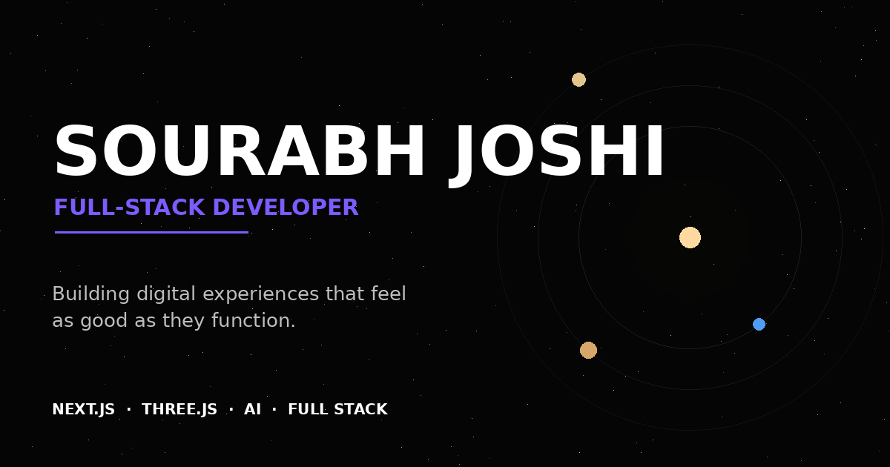

# Sourabh Joshi — Full-Stack Developer Portfolio

A cinematic, single-page portfolio built around a 3D solar system where **every planet is a navigation destination** (Earth → Work, Venus → Skills, Mars → Journey…).

> Designed somewhere between logic and chaos.



---

## ✨ Features

- **Cinematic 3D hero** — React Three Fiber scene with a choreographed intro: stars → galaxy → nebula → sun → planets → hero text. No external textures; everything is procedural.
- **Planets as navigation** — hover for tooltip + scale, click to fly the camera and scroll to the section.
- **2.5D canvas fallback** — automatically used on mobile and when WebGL is unavailable (users never see a broken 3D scene).
- **Case-study modals** — every project opens a full breakdown: Problem → Solution → Features → Architecture → How it works → Challenges → Result.
- **Hand-drawn CSS project mockups** — no fake screenshots, instant loading.
- **Custom context-aware cursor** (desktop only) — dot + ring, `VIEW` on projects, `↗` on links.
- **Full design system** — `#050505` base, `#7C5CFF` accent, Space Grotesk + Inter, 8px spacing rhythm, glass surfaces used sparingly.
- **Accessibility** — keyboard-navigable, visible focus states, `prefers-reduced-motion` support, focus-trapped modal.
- **SEO** — metadata, Open Graph (custom `og.png`), Twitter cards, `robots.txt`, `sitemap.xml`.
- **Easter eggs** — branded `console.log`, and click the **SJ logo 5 times**… 🛸
- **Performance** — lazy-loaded 3D bundle, capped pixel ratio, no heavy textures, `next/font` self-hosted fonts.

## 🛠 Tech Stack

| Layer | Tech |
|---|---|
| Framework | Next.js 15 (App Router) + TypeScript |
| Styling | Tailwind CSS |
| Animation | Framer Motion |
| 3D | Three.js + React Three Fiber + drei |
| Icons | lucide-react |
| Form | Native form + `/api/contact` route (server-side) |

## 🚀 Getting Started

```bash
npm install
npm run dev        # http://localhost:3000
```

Production:

```bash
npm run build
npm start
```

## 🔐 Environment Variables

Copy `.env.example` to `.env.local` and fill in if you want the contact form to send real emails (via [Resend](https://resend.com)):

```
RESEND_API_KEY=re_xxxxxxxx
CONTACT_EMAIL=hello@sourabhjoshi.dev
```

**No key? No problem.** The form gracefully falls back to opening the visitor's mail client. Keys never touch the client bundle.

## ✏️ Before You Publish — Checklist

1. **Replace placeholders** in `src/data/site.ts` — email, GitHub, LinkedIn, Instagram.
2. **Replace project links** in `src/data/projects.ts` — `live` and `github` currently point to `example.com`.
3. **Replace the placeholder testimonials** in `src/data/testimonials.ts` with real quotes (or delete the entries — the section hides itself when empty).
4. **Swap the portrait** in `public/images/portrait.jpg` (or keep the one included).
5. **Update metadata** in `src/app/layout.tsx` — `metadataBase`, URL, and regenerate `public/og.png` if you change your name/photo.
6. **Verify the stats** in `src/data/experience.ts` are accurate.

## 📁 Structure

```
src/
├── app/
│   ├── layout.tsx          # metadata, fonts, OG/Twitter cards
│   ├── page.tsx            # one-page story assembly
│   ├── globals.css         # design tokens, utilities, noise, scrollbar
│   ├── not-found.tsx       # "LOST IN SPACE" 404
│   ├── sitemap.ts
│   └── api/contact/route.ts
├── components/             # Hero, Hero3D, Hero2D, About, Skills, Projects,
│                           # CaseStudy, Journey, Services, Stats, Testimonials,
│                           # Contact, Footer, Navbar, CustomCursor, Preloader…
├── data/                   # projects.ts, skills.ts, experience.ts,
│                           # services.ts, testimonials.ts, site.ts
└── hooks/                  # useMediaQuery, useScrollProgress
```

**Rule:** all content lives in `src/data/` — components never hardcode projects or links. Adding a project = one entry in `projects.ts`.

## 🎨 Design Notes (from the original brief)

- Hero intro timeline: stars (0–1s) → galaxy (1–3s) → travel (3–5s) → sun + planets (4–6s) → settle (6–7s) → text (7s+). Scroll/touch cuts the intro instantly.
- Camera choreography uses damped lerp, not linear `position.z -= 0.1` moves.
- UI-friendly spatial proportions (real astronomy distances would be unusable).
- 90% controlled, 10% visual explosion: the accent appears deliberately, not everywhere.
- Motion explains interaction — hover scale, arrow nudge, underline grow — nothing bounces.

## 📄 License

Free to use as a template for your own portfolio. Replace the content and make it yours.
